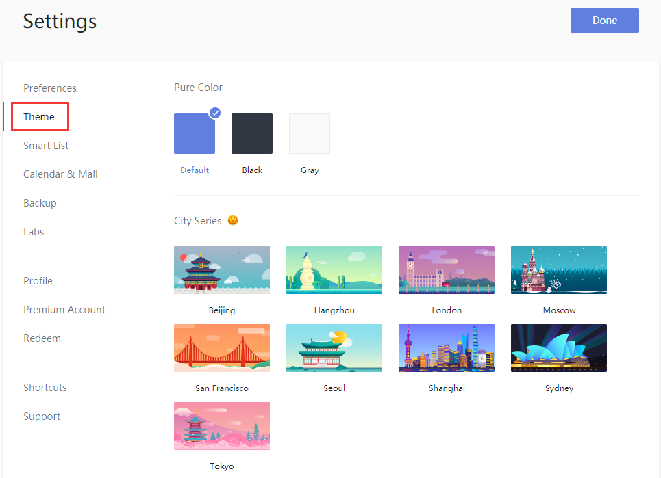

### How to change themes?

1. Sign in to TickTick on the web.

2. Click the avatar in the upper-left corner of TickTick homepage, then click "Settings" from the menu that appears.

3. Click "Themes" in the left panel, then choose colors and themes in the right panel.  

