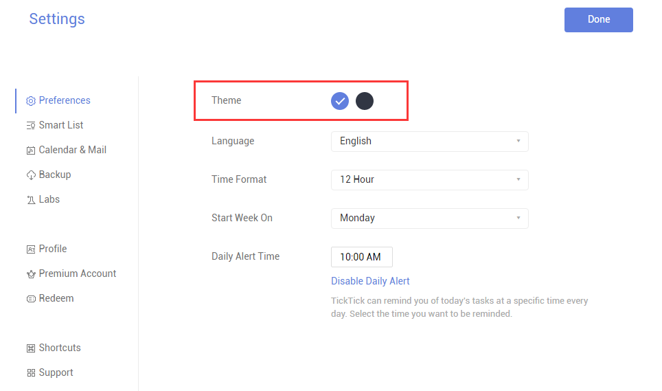

### How to change theme?

1.Sign in TickTick on web.

2.Click the avatar in the upper-left hand corner of the page to select “Settings”.

3.Choose the theme you want to set in the color section.There are two theme options now: blue and black.

