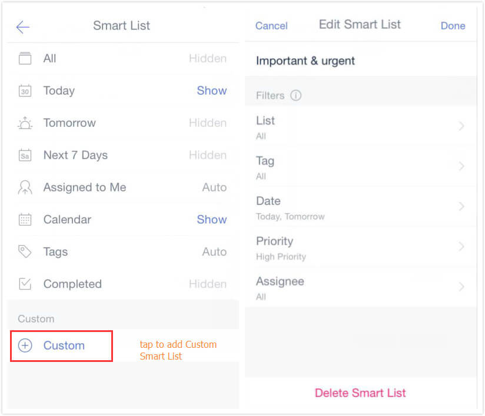
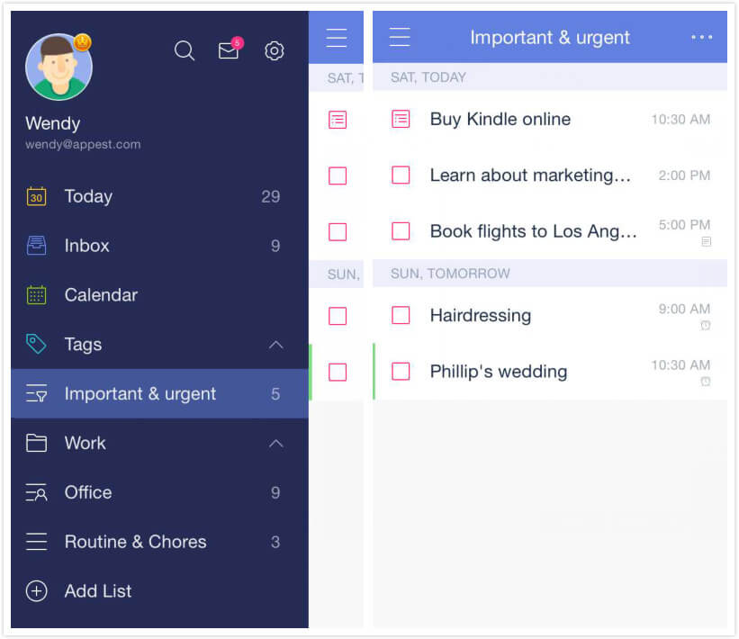
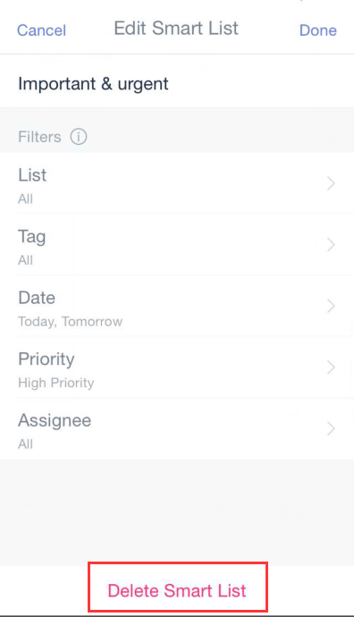

# How to create Custom Smart List?

### To create your own Smart List:

1. Tap Settings in left side bar.
2. Tap "Smart List".
3. Tap "Custom" at the bottom of the screen to add Custom Smart List.

There are 5 filter criteria provided: List, Tag, Date, Priority, Assignee. These Filters are flexible enough to help you generate your own Smart List.

Imagine that you need to focus on only important and urgent schedules, just choose “High priority” and “Today”, “Tomorrow” in Filters to create a custom smart list: Important & urgent.

###  To delete a Custom Smart List:

1. Tap Settings in left side bar.
2. Tap "Smart List".
3. Choose the Custom Smart List you want to delete.
4. Tap "Delete Smart List" at the bottom of the screen.

