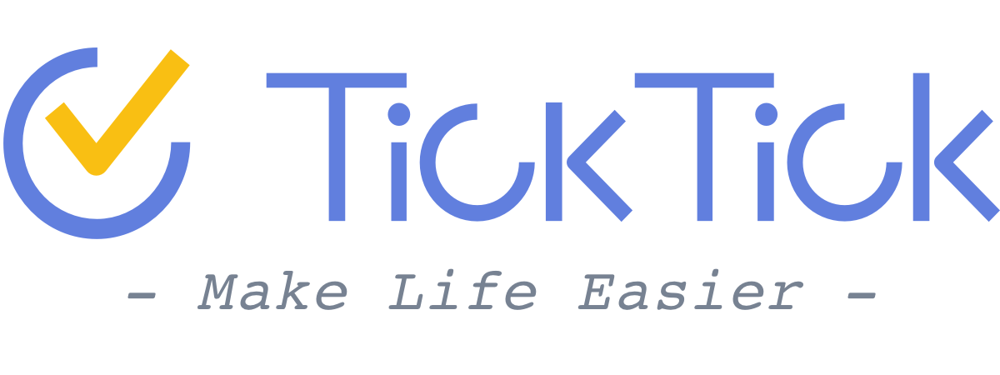

###**What can I find here?**

Hi, welcome to TicKTick!

This guide is divided into six chapters to help you understand the features of TickTick.

| Chapter | Content |
| -- | -- |
|Chapter 0| About TickTick |
|Chapter 1| TickTick Web version |
|Chapter 2| TickTick Android app |
|Chapter 3| TicKTick iOS app |
|Chapter 4| Chrome Extension |
|Chapter 5| Video Tutorials |
  

Feel free to contact us if you have any further questions that are not mentioned here. You may also create a discussion thread at TickTick [Help Center](https://help.ticktick.com/forum) or email us directly [support@ticktick.com](mailto:support@ticktick.com).

 

###Would you like to help us with translation?
We are determined to make TickTick a multi-language app. If you are willing to contribute for part of the translation work, please contact us via email. See below for more information:

<mark>English, Russian, Korean, Hebrew, French, Germany, Italian, Simplified Chinese, Traditional Chinese, Slovak, Ukrainian, Spanish, Hungarian, Portuguese, Dutch, Czech, Japanese, Polish </mark>

Some of the languages above are available only on specific platforms, Let us know if you could help us do better!

