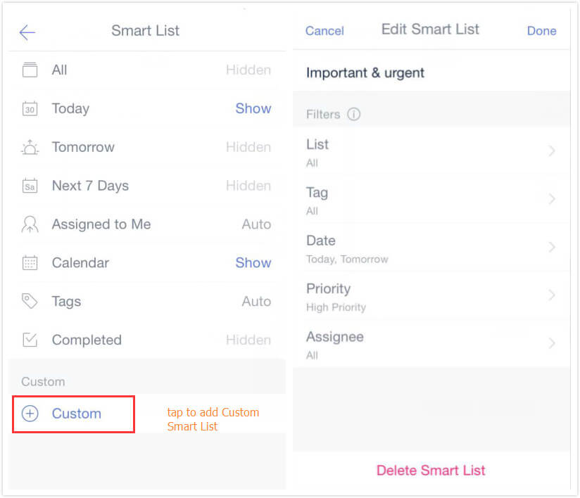
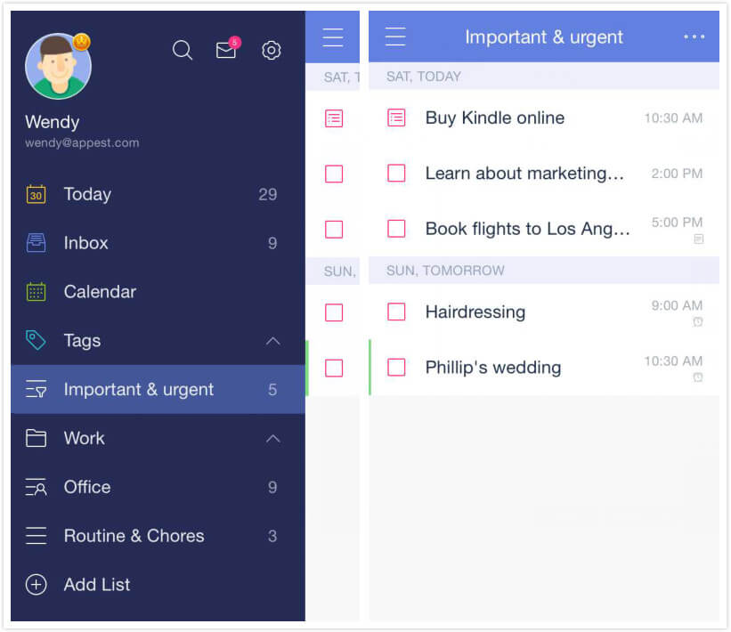
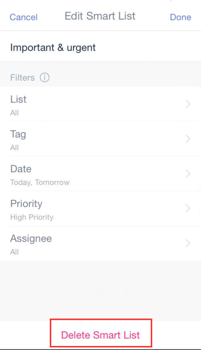

# How to create a Custom Smart List? (Premium)

1. Open TickTick on your iOS device and slide the screen to the right.

2. Click the gear-shaped icon in the upper right corner, then tap "Smart List".

3. Tap "Custom" at the bottom of the screen to add a custom Smart List.

You can sort items by List, Tag, Date, Priority, Assignee. These Filters are flexible enough to help you generate your own Smart List.

If you need to focus on only items you marked with high priority in TickTick, just choose “High priority”, “Today”, and “Tomorrow” in the Smart List filters menu to create a custom smart list which you can name "High Priority" or some similar name.

### Delete a Custom Smart List:

1. Open TickTick on your iOS device and slide the screen to the right.

2. Tap the gear-shaped icon in the upper right corner, then tap "Smart List".

3. Select the Custom Smart List you want to delete.

4. Tap "Delete Smart List" at the bottom of the screen.

