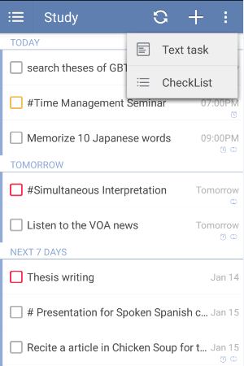
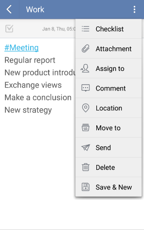

### How to create a task or subtask with checklist?
1.Long press the “+” icon to choose “checklist” and enter checklist items one by one. Checklist can be used to create a shopping list or packing list. Checklist items are affiliated to tasks and therefore they can’t be assigned due dates individually.

2.Select a task and enter the subtask, then click the option menu on the top right and choose "checklist".

