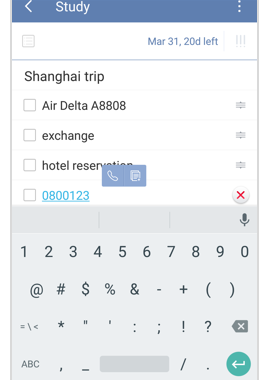

### How to make a phone call directly through a task detail page?
After you enter a phone number in a task detail page, click the screen again, then you will find a pop-up menu with two icons, “Phone call” and “Copy”. If you click the phone-shaped icon, you will be directly led to the page to make a phone call.

