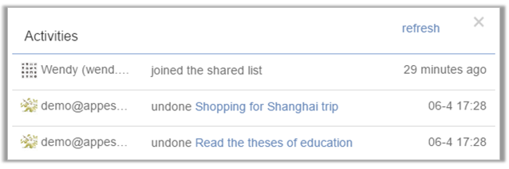

### How to check activities of a list?[Pro only]

"Activities" can help you track every change you/recipients made in a list/shared lists. 

1.From the Lists view click the downward arrow located near a list name. 

2.Select "Activities" to view history.

