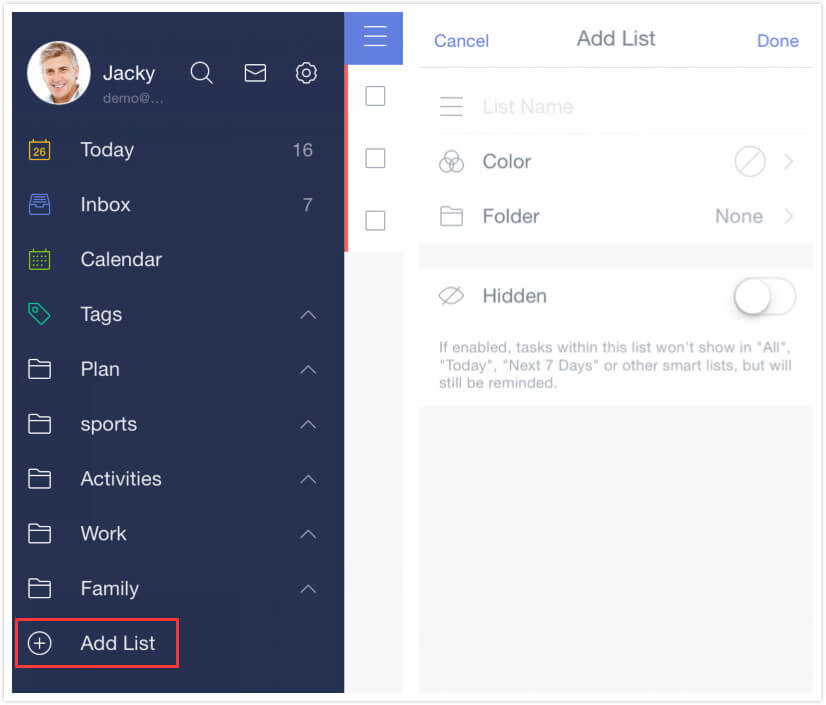

# How to create task lists?

1. Open TickTick on your iOS device and slide the screen to the right.

2. Tap “Add List” at the bottom of the screen.

3. Enter a name for your new list, then tap "Done".

