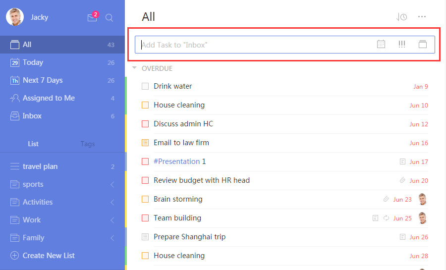
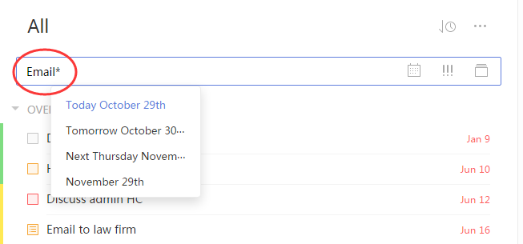
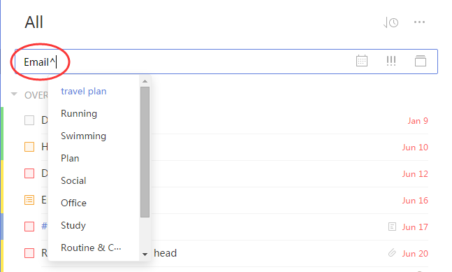

##How to add a new task?
To create a new task, select a list and then click the Add Bar at the top of the screen. Enter task name and then press Enter to add a new task to the list.

 

####**-How to use shortcuts to add a new task?**

**1.The shortcut for due date:**

Type “*” and select a due date in the drop-down menu.

**2.The shortcut for list:**

Type “^” and select a list in the drop-down menu.

**3.Example:**

Type “Go to Party^Entertainment*Tuesday”. Then you will find a new task “Go to party” added in the list “Entertainment”, which due date is Tuesday.
