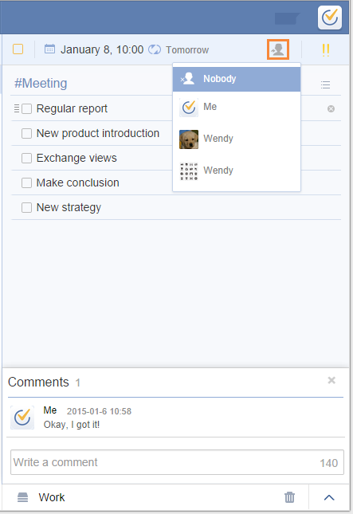

# 6. How to assign a task to someone?
Assiging a task currently is only possible within a shared list.

Click the icon of people in task detail page and choose the one who you want to assign to. And then, you will see the avatar of the assigned person at the end of your selected task. The assigned member will receive a notification.

