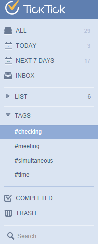

# 2. How to add Tag to a task?

"Tag" is another way to group tasks, which is especially used to add context for your tasks.

First, click the avatar on top right corner to enter "Labs" to enable "Tags"

Then you can start creating tasks by adding the "#" symbol in front of any word or phrase. You can add up to 5 tags to each task.

When clicking on the "Tags" tab on the left panel, you will be directed to the list, where all tasks labeled by this tag will be displayed.

