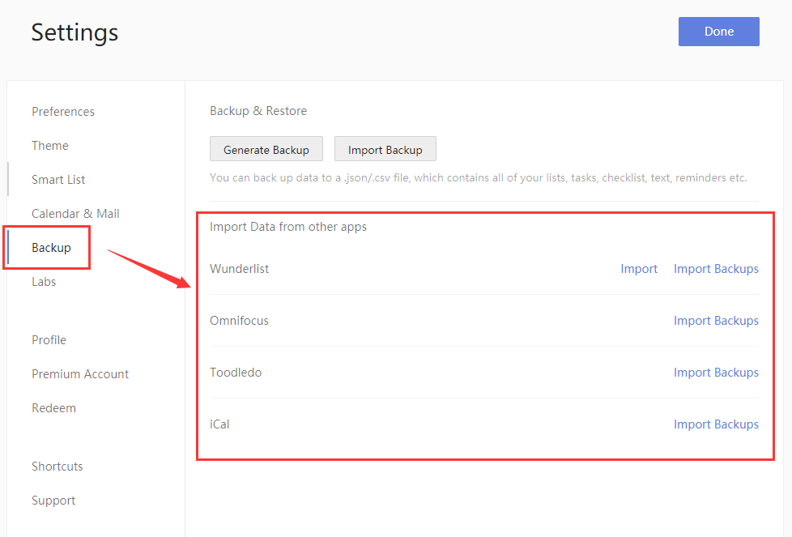

### How to import tasks from other apps into TickTick?

1. Sign in to TickTick on the web.

2. Click the avatar in the upper-left corner of your TickTick homepage, then click "Settings" from the menu that appears.

3. Click "Backup" in the left panel, and click the "Import" link associated with the app file you want to import.

You can import tasks from apps such as Astrid, Wunderlist, and Toodledo.

