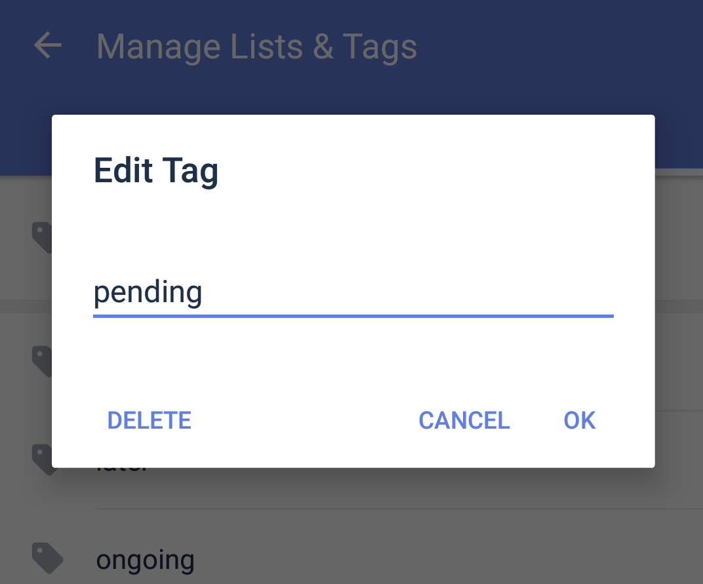

### How to edit / delete existing tags?

Once you have a commonly used tag that’s associated with many tasks, edit the tag name or delete the tag and auto remove it from all tasks would be very useful. In TickTick, you can batch edit tags without going into each task. 

How: 
Manage Lists & Tags - Tags - Select the tag you want to edit / delete

