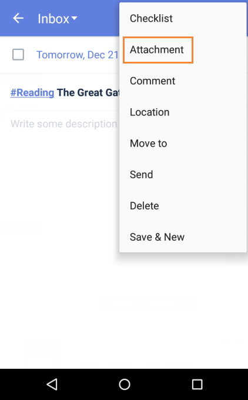

###How to upload an attachment in a task?
1.Open TickTick on your android device, and enter a task. 

2.Tap the option menu in the upper right hand corner to select “Attachment”.

You can add images, audios, videos or other regular files to a task. If it is in a shared list, all members in this list can view and save attachments. 

