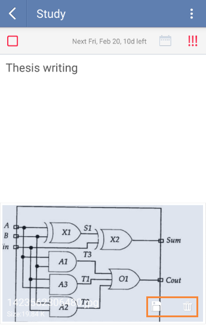

###How to upload an attachment in a task?
Select a task and click “Attachment” from the option menu. You can upload images, audios, videos or other regular files in tasks.

After it is uploaded, you can view it in task detail page and long pressing the attachment will trigger editing actions such as save & delete.

