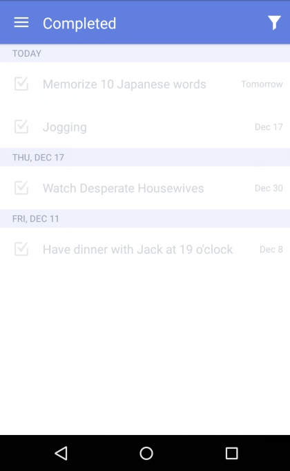

### Where can I check all completed tasks?
You can check all completed tasks in “Completed” list which is hidden by default. Please turn to 2.2.1 to learn how to enable “Completed” list in TickTick.

Tasks in “Completed” list are sorted by completion date. If you want to view completed tasks in a specific list, you can tap the funnel-shaped icon in the upper right hand corner to select a list. Dates at left are completion dates while dates at right are due dates.

