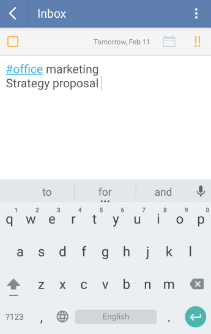

### How to add “Tags” to a task?
“Tags” list helps you filter all of your tasks in TickTick. “Tags” list is hidden by default. For more details about how to enable “Tags”, please turn to 2.3.1.

You can attach at most 5 tags to each task. To tag a to-do, simply add a hashtag to a keyword. For example, “#office”. Then just add the word “#office” to all relevant tasks. 

