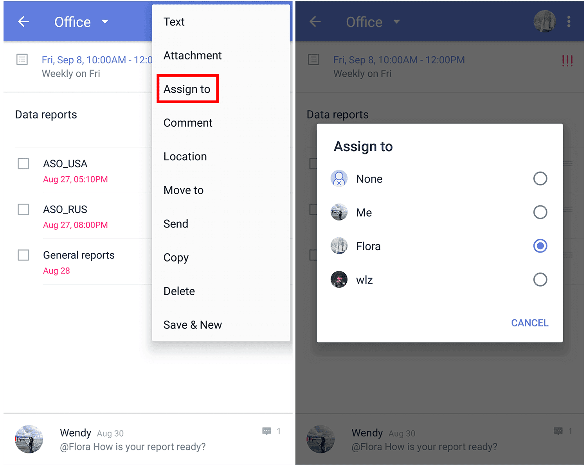

### How to add comment on a task?

1. Open TickTick on your android device.

2. Go to a task's detail page, then tap on the option menu in the upper-right corner.

3. Tap "Comment" and enter a comment. If the task you commented on is in a shared list, all members can view your comment and make their own comments.

The "Comment" feature is used to add extra remarks to a task. Within a shared list, all shared members can comment on any tasks to realize real-time chat and communication. If you want to reply to someone in a shared list, you can enter "@" to select a member, or tap the member's icon to reply to that person directly.

The member you reply to will receive immediate notification in TickTick.

