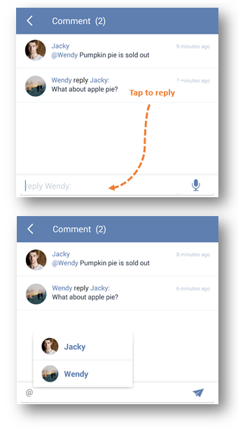
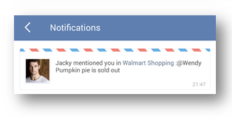

### How to add comment on a task?
1.Open TickTick on your android device.

2.Enter a task detail page to tap the option menu in the upper right hand corner.

If it is in a shared list, all members can view your comments and make comments as well.

You can watch the video below from 00:43 to 01:01.

<iframe width="700" height="400" src="https://www.youtube.com/embed/0y4hkxRUOoo?list=PLbWRKVi0_aTFbQcYoQHar2TR88yoO190U" frameborder="0" allowfullscreen></iframe>

“Comment” is always used to add extra remarks to a task. 

Within a shared list, all shared members can comment on any tasks to realize real chat & communication. If you want to @reply someone in a shared list, you can enter “@” to select a member or click the icon to reply someone directly. 

The member you @reply will get notification in TickTick immediately. 

