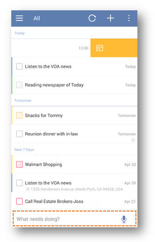
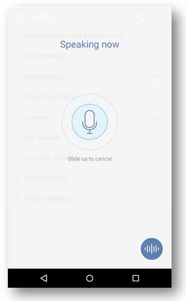

### How to use different ways to create a new task?

<iframe width="700" height="400" src="https://www.youtube.com/embed/-npsJ9oIasU?list=PLbWRKVi0_aTFbQcYoQHar2TR88yoO190U" frameborder="0" allowfullscreen></iframe>

There are four ways to add a new task.

**-Option 1: Click “+” to add a task.**

You can tap “+” icon in the upper-right hand of the screen to create a new task.

 

**-Option 2: Add a task to Quick Add Bar with due date and priority.**

If you have enabled “Quick add bar”, you can create a task directly at the bottom of the task page. To enable “Quick add bar”, You should:

1.Slide the screen to the right.

2.Tap the gear-shaped icon in the upper-right hand of the screen.

3.Tap “More” to enable “Quick add”, and the quick add bar will appear at the bottom of the task page.

 

**-Option 3: Add a task from “Status Bar”.**

Status Bar is a persistent notification bar entry where you can add a task directly. To enable “Status Bar”, You should:

1.Slide the screen to the right.

2.Tap the gear-shaped icon in the upper-right hand of the screen.

2.Tap “More” to enable “Status Bar”.

Status bar is in the pull-down menu of your phone. You can click “+” on the Status bar to add a task without entering Ticktick.

 

**-Option 4: Add a task from widget(turn to 2.6.5 for details).**

**-Option 5: Add a task by voice input.**

Press and hold the add button to speak. For example, you can say “pick up Jack tomorrow at 10 AM”. Then a task “pick up Jack tomorrow at 10 AM” will be generated with due date (tomorrow) and reminder time (10 AM).

**-Option 6: Add a task by “note to self” voice command with Google Now.**

1.Make sure that your phone is equipped with Google Now.

2.Hit the microphone icon on the search widget to initiate a voice-based search.

3.Start by saying “note to self”. For example, you can say “note to self, have lunch with Jack tomorrow at 13.”  

4.Select TickTick to save the task.

