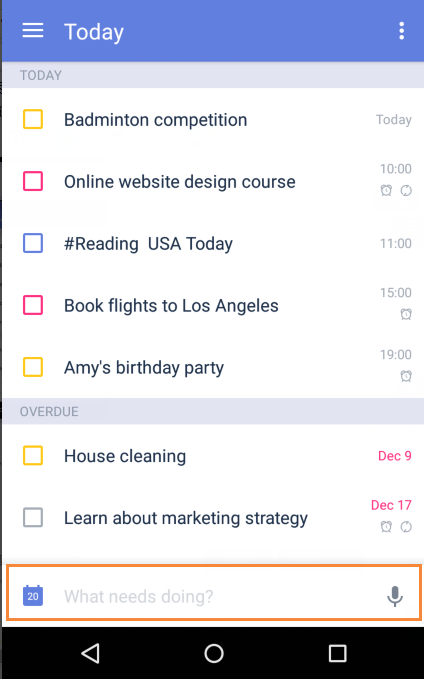

### How to create a new task?

There are six ways to add a new task.

**-Option 1: Add a task to Quick Add Bar with due date.**

 “Quick add" is enabled by default, you can create a task by typing or voice input at the bottom of the task page, and choose a due date by taping the calendar icon.
 
 

#### **How to use Smart Date Parsing when adding tasks from Quick Add bar?**

If you type date and time information when adding tasks from Quick Add bar, TickTick will automatically recognizes date as due date and set the time as reminder.

For example, if you want to go to library on next Saturday at 2 pm, you just need to type: “Go to library next Saturday 2 pm”, then TickTick will automatically recognize the date of next Saturday as the task’s due date and set 2 pm as its reminder. 

- How to remove date & time info from task content when using Smart Date Parsing?

If you prefer date and time not showing in your task content after task is created, you can set it in Settings, Advanced Settings, Smart Date Parsing, Remove Text in Tasks.

After "Remove Text in Tasks" is enabled, the highlighted date & time text will be removed when adding tasks.

**-Option 2: Click “+” to add a task.**

If you disenable "Quick Add",you can tap “+” icon in the lower-right hand corner of the screen to create a new task.

To disenable "Quick Add" and make "+" button back, You should:

1.Slide the screen to the right.

2.Tap the gear-shaped icon in the upper-right hand of the screen.

3.Tap “Advanced Settings” to disenable “Quick Add”, and "+" button will appear at the lower-right hand corner of task page.

 
**-Option 3: Add a task from “Status Bar”.**

Status Bar is a persistent notification bar entry where you can add a task directly. To enable “Status Bar”, You should:

1.Slide the screen to the right.

2.Tap the gear-shaped icon in the upper-right hand of the screen.

2.Tap “Advanced Settings” to enable “Status Bar”.

Status bar is in the pull-down menu of your phone. You can click “+” on the Status bar to add a task without entering Ticktick.

**-Option 4: Add a task from widget (turn to 2.6.5 for details).**

**-Option 5: Add a task by voice input.**

Press and hold the add button to speak. For example, you can say “pick up Jack tomorrow at 10 AM”. Then a task “pick up Jack tomorrow at 10 AM” will be generated with due date (tomorrow) and reminder time (10 AM).

**-Option 6: Add a task by “note to self” voice command with Google Now.**

1.Make sure that your phone is equipped with Google Now.

2.Hit the microphone icon on the search widget to initiate a voice-based search.

3.Start by saying “note to self”. For example, you can say “note to self, have lunch with Jack tomorrow at 13.”  

4.Select TickTick to save the task.

