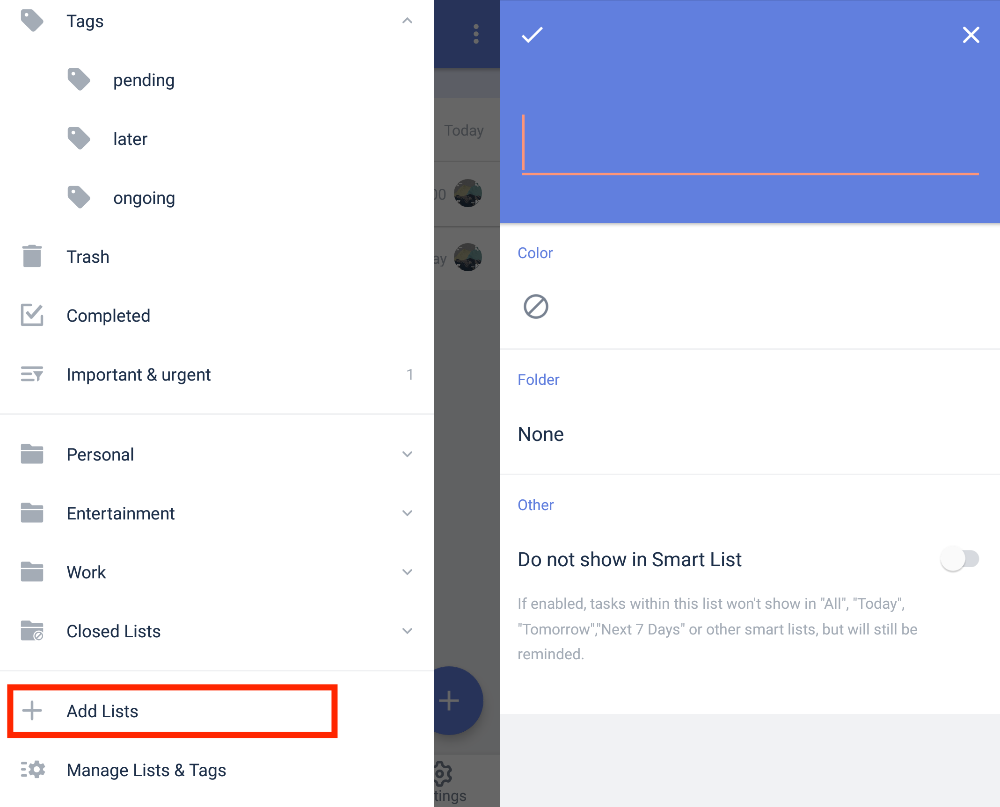

### How to create a task list?

1. Open TickTick on your Android device, then either swipe to the right or tap the hamburger button in the upper-left corner.

2. Tap "Add lists" at the bottom of list menu.

3. Enter a name for your list, then choose a color. This menu also lets you assign the new list to an existing folder or create a new folder in which to store it.

