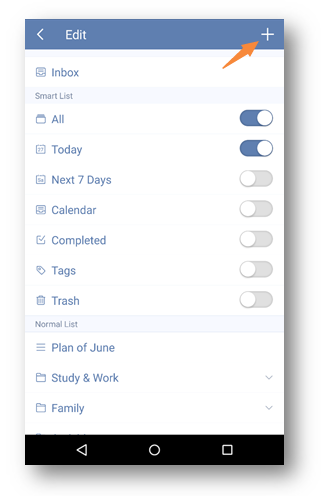

### How to create a task list?
1.Open TickTick on your android device.

2.Slide the screen to the right to tap “Edit List” at the bottom.

3.Click “+” in the upper right hand corner to create a new task list with name, color, etc.

