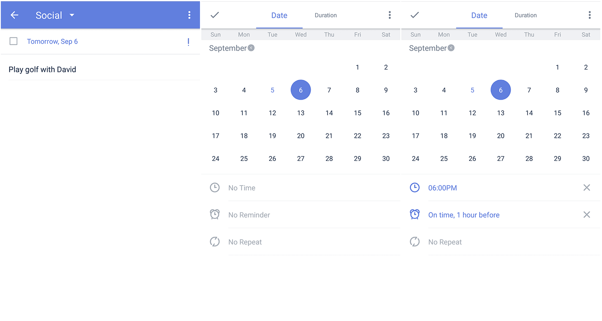

### How to add reminders to a task?

1. Open TickTick on your Android device, then either swipe to the right or tap the hamburger button in the upper-left corner.

2. Enter a task detail page and tap the due date at the top of the page.

3. Tap the alarm clock icon to set a reminder time.

Preset reminder times include on time, 5 minutes before, 30 minutes before, 1 hour before, 1 day before, and 2 days before. Tap "+ Custom" to set a custom reminder. All new tasks have a default reminder of "on time" so that the reminder will occur at the same time as the time you set for that task to occur.

