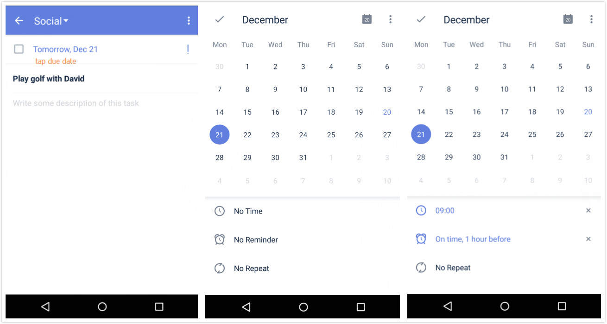

## How to add reminders to a task?
1.Open TickTick on your android device.

2.Enter a task detail page to tap its due date.

3.Set a reminder time below the calendar.

If you want to add more reminders, you can click “Reminder” bar to add reminders like “1 hours before”, “3 weeks before”, etc. You can also choose "Custom" to set reminders you need.Free users are allowed to add two reminders, while Pro users can add five. 

