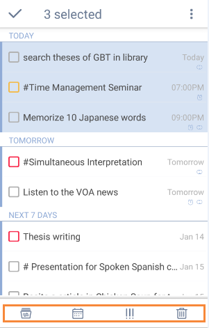

### How to edit multiple tasks at a time?
If you want to edit a batch of tasks at once, you can:

1.Long press a task and then choose other tasks you want to edit together.

2.Set due date, priority, certain list, or delete them with the pop-up menu at the bottom.

