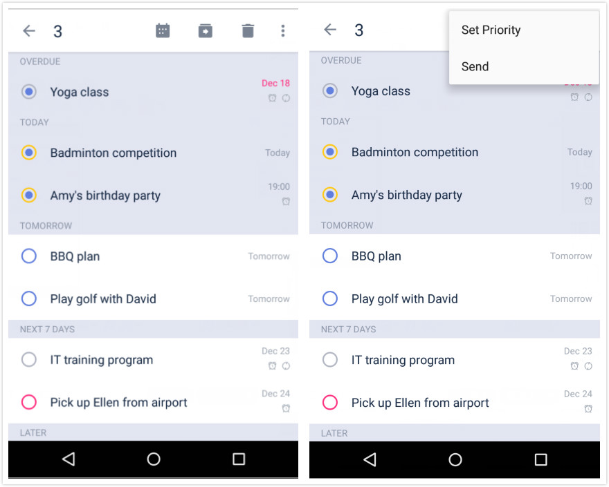

### How to batch edit tasks?

Batch editing applies to all of the tasks you selected. Batch editing allows you to apply a new due date and time, move tasks to another list, delete tasks, set a priority level for the tasks, send someone a list of your selected tasks, and merge the selected tasks into one task.

1. Open TickTick on your Android device, and bring up a task view page.

2. Long press a task, then tap on any other tasks you want to batch edit.

3. Choose an option at the top of the screen \(for example, delete the batch of tasks by tapping the Trash Can button\).

