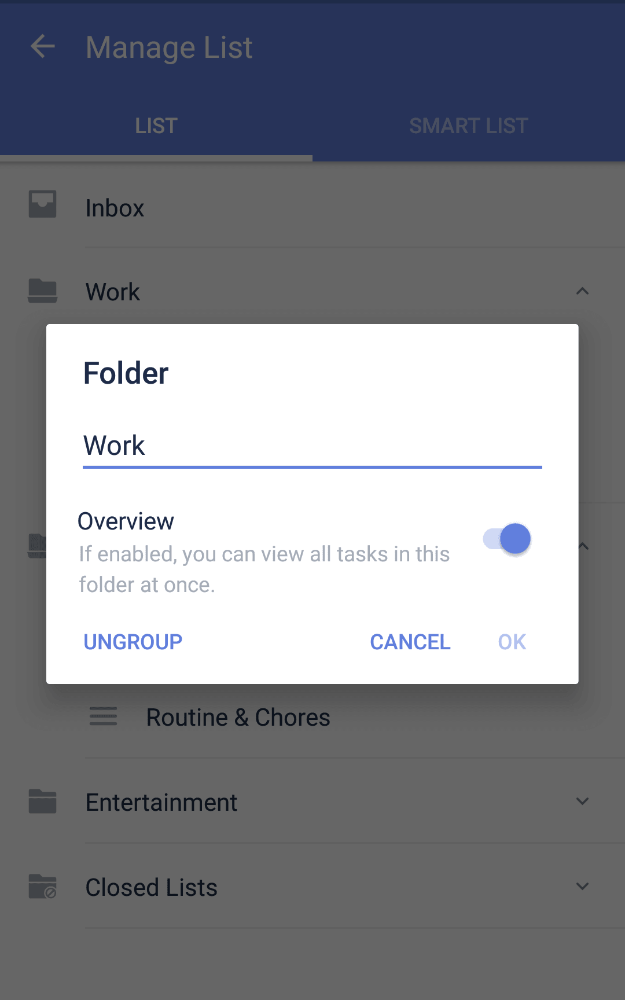

### How to edit lists and folders?

1. Open TickTick on your Android device, then scroll down the left side bar and find "Manage List".

2. Tap "Manage List", then find the list/folder you want to edit and tap into it. 

3. Make changes, then tap the TickTick icon at the top left to save and go back.

