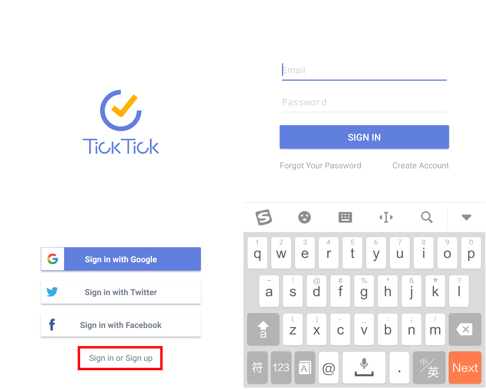

### How to sign in?

You can sign in with your gmail, Google+, Facebook, or Twitter account directly, or sign up for a new account with a valid email address.

If you would like to try the TickTick Android app before registering an account, tap "Try" and familiarize yourself with the app. But be aware that your tasks cannot be synced until you use a registered account.

