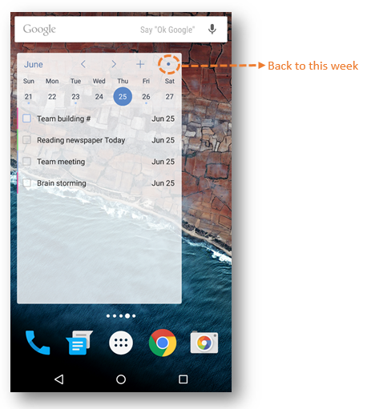

## Which kind of widgets does TickTick have?
The following widgets are available: TickTick views in 2×2, 4×2, 4×3, and 4x4;  TickTick Week view in 4×3; TickTick Shortcut view in 1×1; TickTick Undone view in 1×1. Choose a preferred widget according to your needs.

 

**What is special to TickTick (Week) widget?**

The interface of TickTick (week) widget is like Calendar View. The upper side of widget is a calendar in week view. Just tap a date, and tasks will be displayed in the lower side of the widget. You can tap left/right arrow to move to the last/next week, and tap the dot in the upper right hand corner of the widget to move back to this week. 

