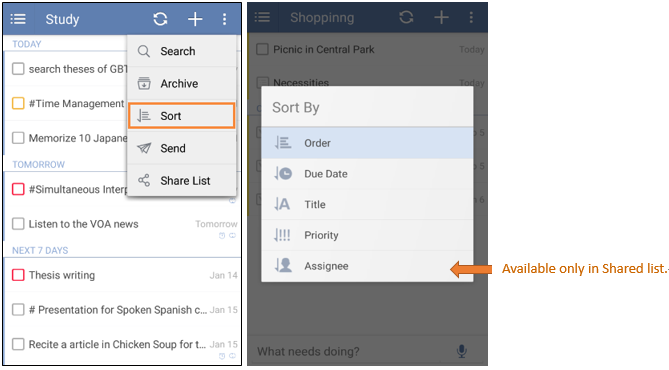

### How to change the order of tasks?

1.Select a list first.

2.Click the option menu on the top right, then click “Sort”.

Tasks under self-defined lists and “Inbox” can be sorted by order, due date, title, and priority. Shared tasks can also be sorted by assignee.

**-How to manually drag tasks?**

1.Sort tasks by order.

2.Long press a task.

3.Press the “Move” icon (at the end of each task) to drag tasks.

