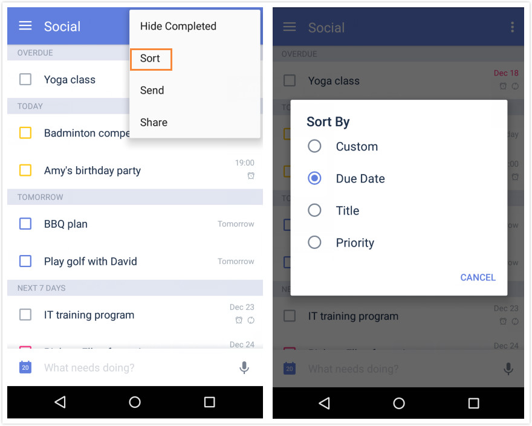

### How to change the order of tasks?

1.Open TickTick on your android device and select a list.

2.Tap the option menu in the upper right hand corner to tap “Sort”.

Tasks under self-defined lists and “Inbox” can be sorted by due date, title, and priority. Tasks in a shared list can be sorted by assignee, and tasks in “All” can be sorted by list.

**-How to drag tasks to change their order?**

1.Sort tasks by “Custom”.

2.Press and hold a task to drag them manually.

