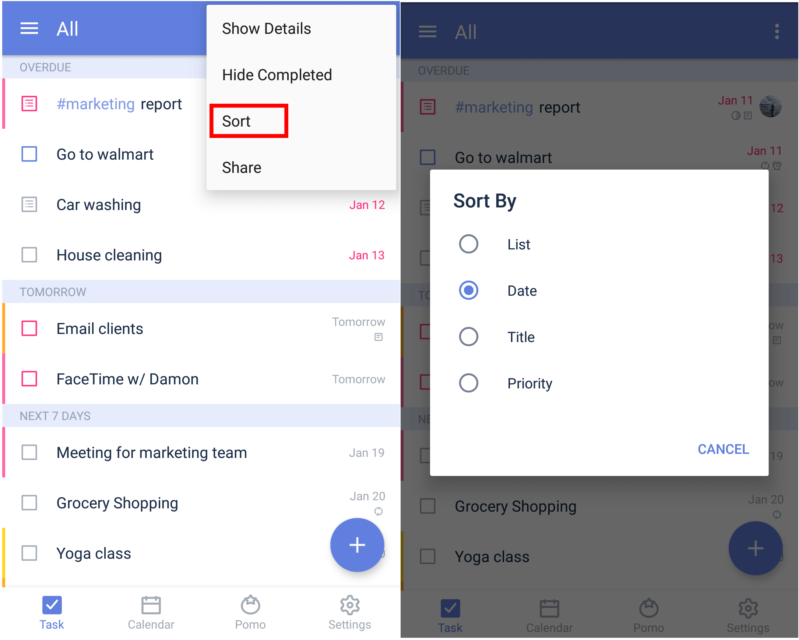

### How to change the order of tasks?

1. Open TickTick on your Android device, then either swipe to the right or tap the hamburger button in the upper-left corner.

2. Tap the list you wish to sort, then tap the option menu in the upper-right corner.

3. Tap "Sort" and choose a sorting filter. All lists can be sorted by the due date, title, and priority of tasks inside the list. Tasks in the "All", "Today", and "Next 7 Days" lists can also be sorted by list name.

#### Drag tasks to change their order:

1. Sort tasks by "Custom". \(This is the default sorting filter.\)

2. Tap and hold a task to drag it up or down, then release your finger when the task is where you want it to be in the list.

