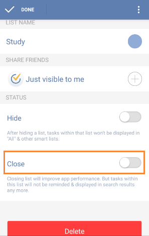

### What's the difference between closed lists and hidden lists?

Some "Smart lists" in TickTick, such as “Today” and “Completed”，can only be hidden if you want to keep concise and do not want to view them in left panel of task list.

Self-defined lists can be both hidden and closed. For example, if you have a list which is about your future plan and it is inactive temporarily, you can choose to hide it, so that its tasks won’t be displayed in “All” & other smart lists. However, if you close a list, the tasks within this list will not be remindered & displayed in search results any more.

**How to close or hide a list?**
1.Slide the screen to the right from margin.

2.Click “Edit” to choose a list.

3.Choose to close or hide it.

