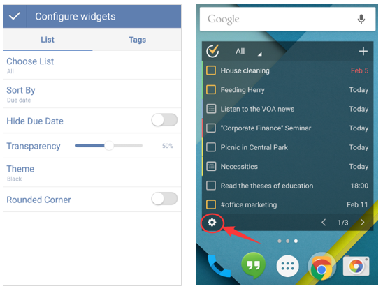

##How to configure widget?
Before a widget successfully displays in the screen, you will be asked to configure it first. If you choose to display TickTick 4×2, TickTick 4×3, TickTick4×4 widget, you can set the content in the widget(list or tags), sort option, ststus of due date, transparency, theme, and the shape of corner. Once a widget display in your screen, you can click the gear-shaped icon on the widget to configure it again.

