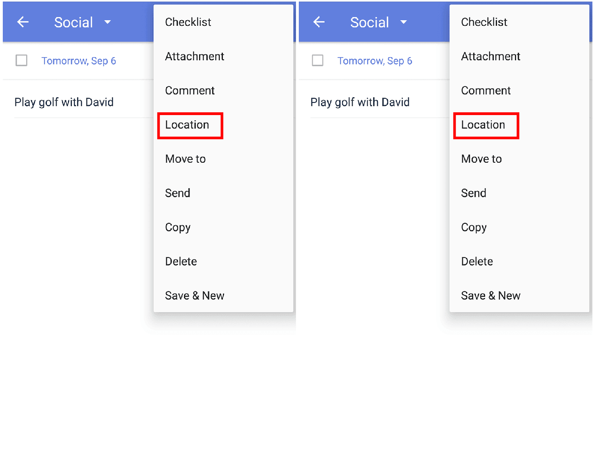

### How to set up location-based reminder?

1. Open TickTick on your Android device, then either swipe to the right or tap the hamburger button in the upper-left corner.

2. Enter a task detail page and tap the option menu in the upper-right corner, then tap "Location".

3. Enter an address and choose to be reminded either upon arrival or leaving.

Your phone's location services \(GPS\) must be active for location-based reminders to function.

