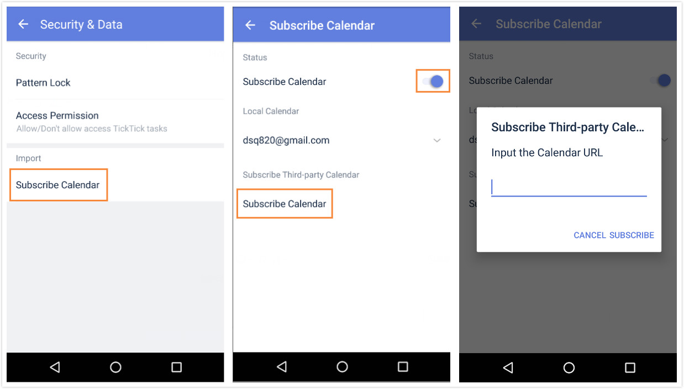

### How to subscribe other calendar service? <mark>[Pro only]</mark>

1.Open TickTick on your android device. 

2.Slide the screen to the right, and tap the gear-shaped icon in the upper right hand corner.

3.Tap “Security & Data” > “Subscribe Calendar”.

4.Tap “Subscribe Calendar” in the “Subscribe Third-Party Calendar” section to enter a Calendar URL. 

