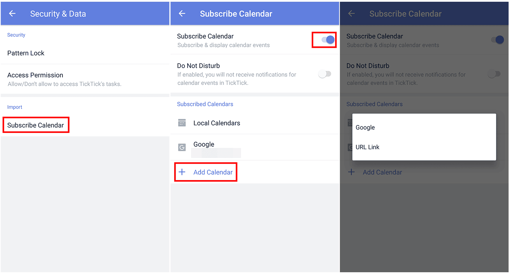

### How to subscribe other calendar service? (Premium)

1. Open TickTick on your Android device, then either swipe to the right or tap the hamburger button in the upper-left corner.

2. Tap the gear-shaped icon in the upper-right corner.

3. Tap "Security & Data", then tap "Subscribe Calendar".

4. Enable "Subscribe Calendar", then tap "+ Add Account", then tap the calendar you want to subscribe to or tap "Add URL" to enter a Calendar URL.

