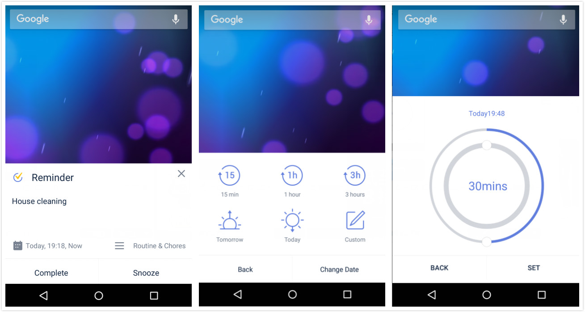

### How to set up reminder pop-ups?

1. Open TickTick on your Android device, then either swipe to the right or tap the hamburger button in the upper-left corner.

2. Tap the gear-shaped icon in the upper-right corner.

3. Tap "Reminder", then tap "Reminder pop-ups".

 

**What is special about reminder pop-ups?**

When getting a pop-up reminder, you can set custom snooze time. Tap snooze to select an existing snooze time, or tap "Custom" to set it by yourself, or even choose another date. 

