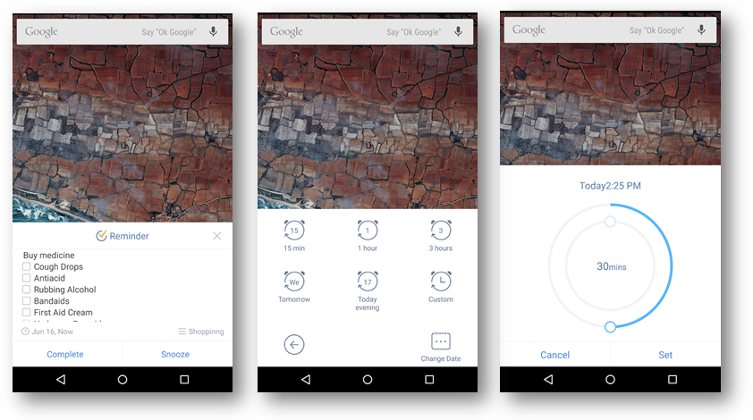

## How to set reminder pop-ups?
1.Open TickTick on your android device.

2.Slide the screen to the right and tap the gear-shaped icon in the upper right hand corner.

3.Tap “Reminder” > “Reminder pop-ups”.

 

**-What special to reminder pop-ups?**

When you get a pop-up reminder, you can set custom snooze time. Tap snooze to select an existing snooze time, or tap “Custom” to set it by yourself, or even choose another date. 

