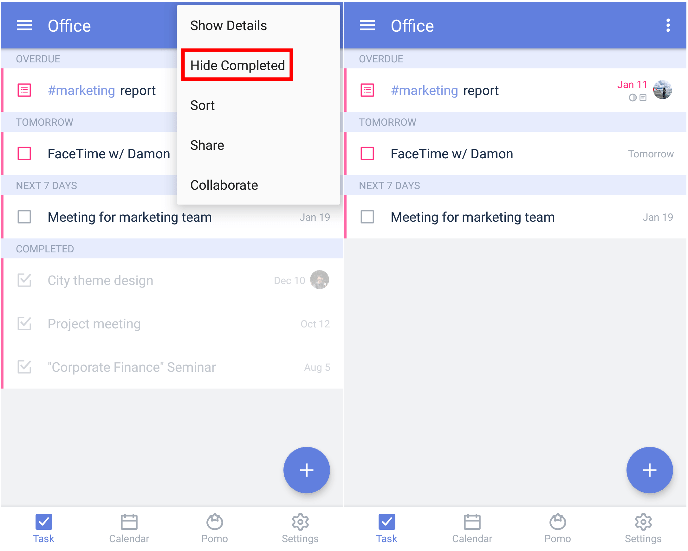

### How to hide or show completed tasks?

Completed tasks are displayed at the bottom of each list in faded text. To hide or show completed tasks, you can tap the option menu in the upper-right corner and tap "Hide Completed" or "Show Completed".

