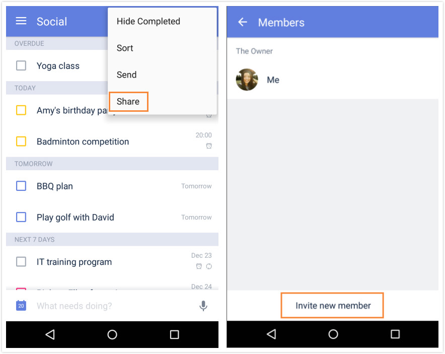
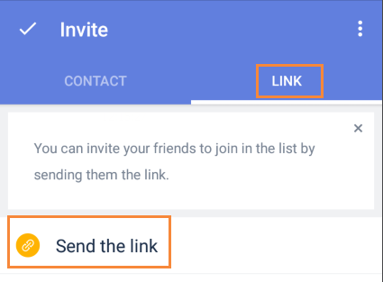

### How to share task lists with TickTick users?
Sharing lists is a great way to collaborate with friends, family, and colleagues to achieve more in TickTick.

 

**-Option 1: Add recipients**

1.Open TickTick on your andorid device and select a task list.

2.Tap “Share” from the option menu in the upper right hand corner.
3.Tap "Invite new member".

3.Input Email or name to add members.

 

**-Option 2: Share via link**

Link is an easier way to share lists. You only need to send the link via social platform. If someone clicks the link, TickTick will send a notification asking you whether you would like to add him or her to the list. If you agree, the list will be shared with your friend automatically. 

