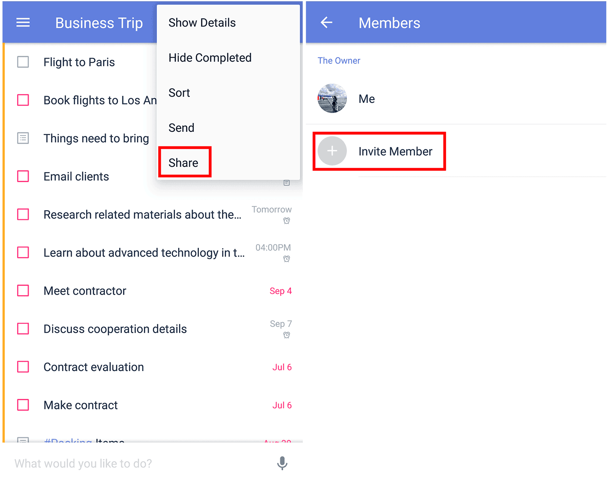

### How to share lists with TickTick users?
Sharing lists is a great way to collaborate with friends, family, and colleagues and achieve your goals. TickTick provides this functionality. There are two ways to share lists.

 

**Option 1: Add recipients**

1. Open TickTick on your Android device, then either swipe to the right or tap the hamburger button in the upper-left corner.

2. Tap the list you want to share, then Tap "Share" from the option menu in the upper right corner. 

3. Tap "Invite new member".

4. Enter the email address, or name, of the TickTick user, then select that user from the name of existing TickTick members that should appear below. 

 

**Option 2: Share via link**

1. Open TickTick on your Android device, then either swipe to the right or tap the hamburger button in the upper-left corner.

2. Tap the list you want to share, then Tap "Share" from the option menu in the upper right corner. 

3. Tap "Invite new member", then tap "Link" in the upper-right corner.

4. Tap "Send the Link" and choose from among the many options TickTick gives you to send the link (for example, Gmail, Tweet, LinkedIn, Facebook Messenger, etc.).

