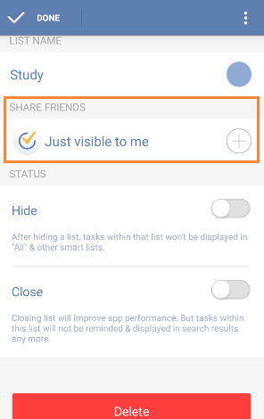

### How to share task lists with others?
With a shared list, it is easy to check a shopping list with your parents or discuss a meeting agenda with your colleagues.

 

**-Option 1: Add recipients**

1.Select a task list first and click “Share List” from the option menu on the top right.

2.Click the “add” icon on the top right to choose recipients from contacts or enter email address directly.

You can watch the video below from 00:00 to 00:22.

<iframe width="700" height="400" src="https://www.youtube.com/embed/0y4hkxRUOoo?list=PLbWRKVi0_aTFbQcYoQHar2TR88yoO190U" frameborder="0" allowfullscreen></iframe>

 

Another place to add recipients is list setting page.

1.You can slide the screen to the right from margin or click the bulleted list icon on the top left of the toolbar.

2.Click “Edit List”.

3.Choose a list and click the “+” under the item of “SHARE FRIENDS” to add recipients.

**-Option 2: Share via link**

Link is an easy way to share lists. You don't need to enter email address, and instead you only need to share the link via social media. Then recipients can sign in TickTick to accept the list.

