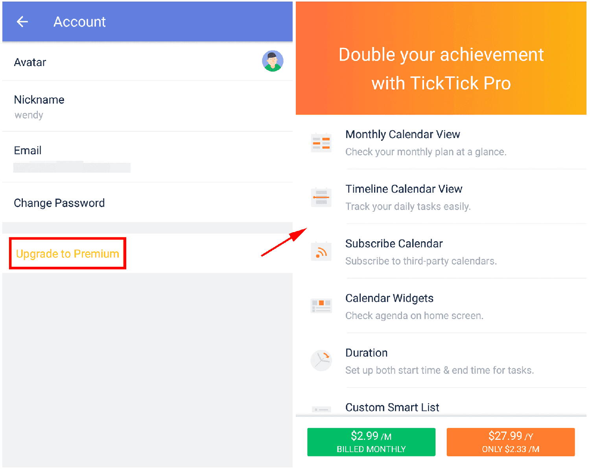

### How to upgrade to/renew a Premium account?

1. Open TickTick on your Android device, then either swipe to the right or tap the hamburger button in the upper-left corner.

2. Tap your avatar in the upper-left corner to enter account details.

3. Tap "Upgrade to Premium", then select the monthly fee ($2.79) or the annual fee ($27.99) to complete your Premium subscription via Paypal.

