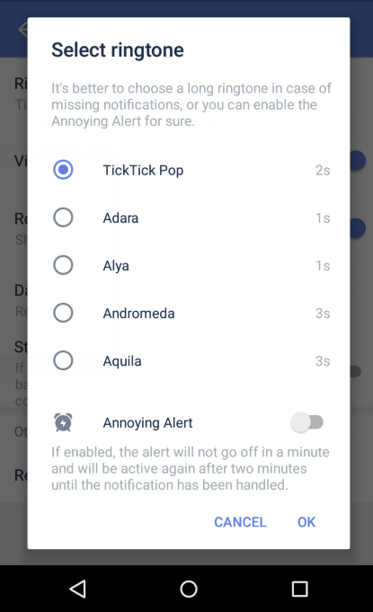

### How to set reminder ringtone and annoying alert?

### Reminder ringtones:

1. Open TickTick on your Android device, then either swipe to the right or tap the hamburger button in the upper-left corner.

2. Tap the gear-shaped icon in the upper-right corner.

3. Tap "Reminder", then tap "Ringtone" to select a reminder ringtone.

### 

### Annoying alert:

If "annoying alert" enabled, the alert will not go off in a minute and will be active again after two minutes until the notification has been handled.

1. Open TickTick on your Android device, then either swipe to the right or tap the hamburger button in the upper-left corner.

2. Tap the gear-shaped icon in the upper-right corner.

3. Tap "Reminder", then tap "Ringtone", then choose "annoying alert".

