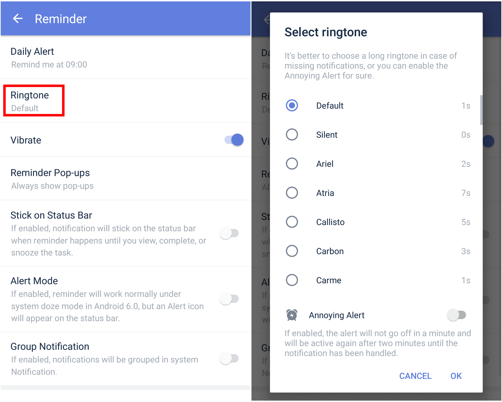
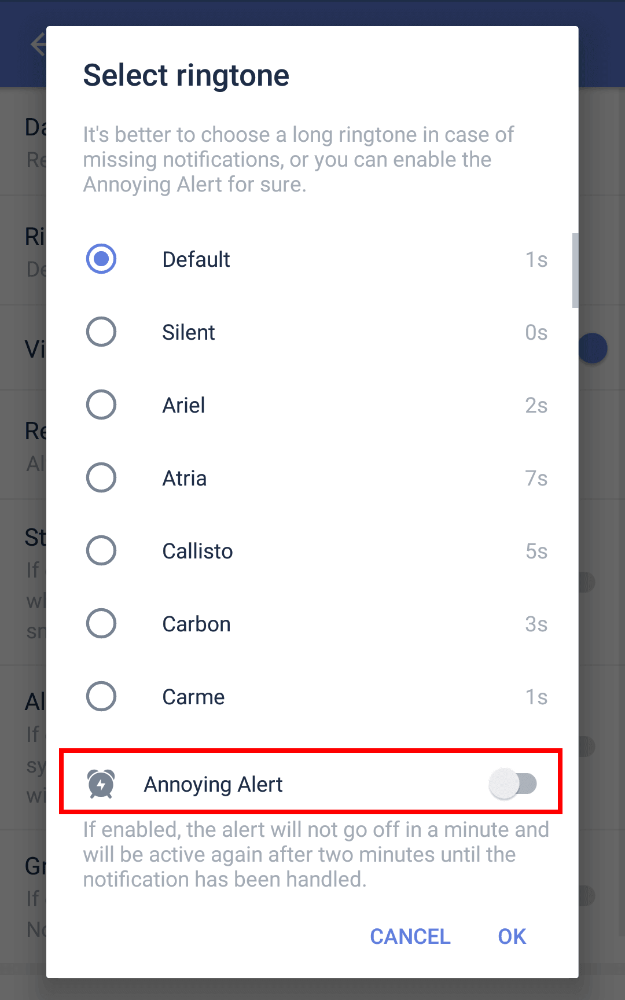

### How to set reminder ringtone and annoying alert?

### Reminder ringtones:

1. Open TickTick on your Android device, then go to the Settings tab page.

2. Tap "Reminder", then tap "Ringtone" to select a reminder ringtone.
 

 

#### Annoying alert:

If "annoying alert" enabled, the alert will not go off in a minute and will be active again after two minutes until the notification has been handled.

1. Open TickTick on your Android device, then go to the Settings tab page.

3. Tap "Reminder", then tap "Ringtone", then choose "annoying alert".

