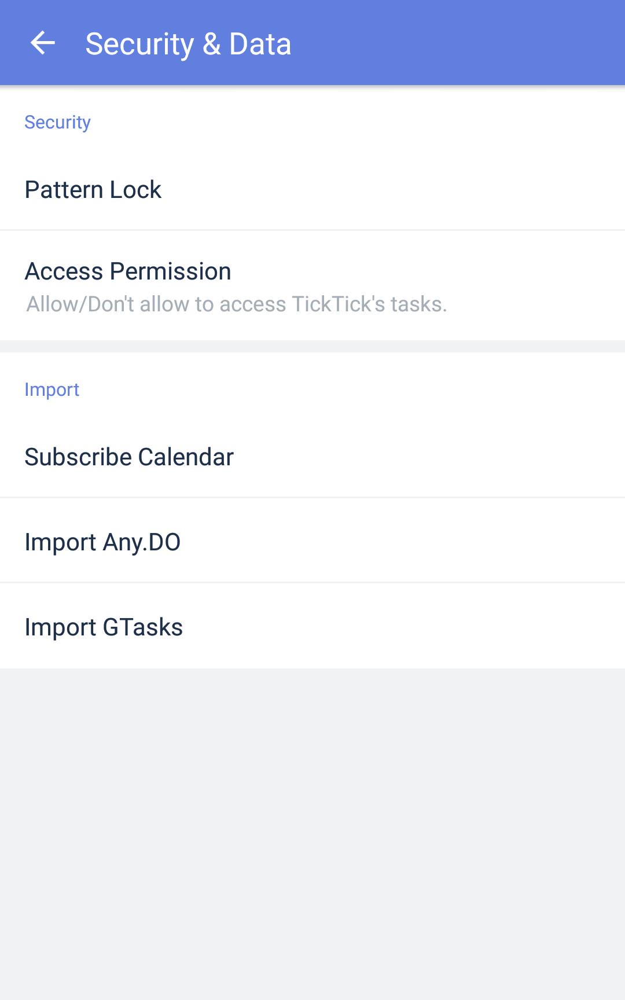

### How to lock the app for privacy?

To enhance the privacy of your data in TickTick, use the Lock feature.

1. Open TickTick on your Android device, then go to the Settings tab page.

2. Tap "Security & Data", then "Pattern Lock" to enable Pattern Lock.

4. Trace an unlock pattern twice to set a pattern lock for TickTick.

