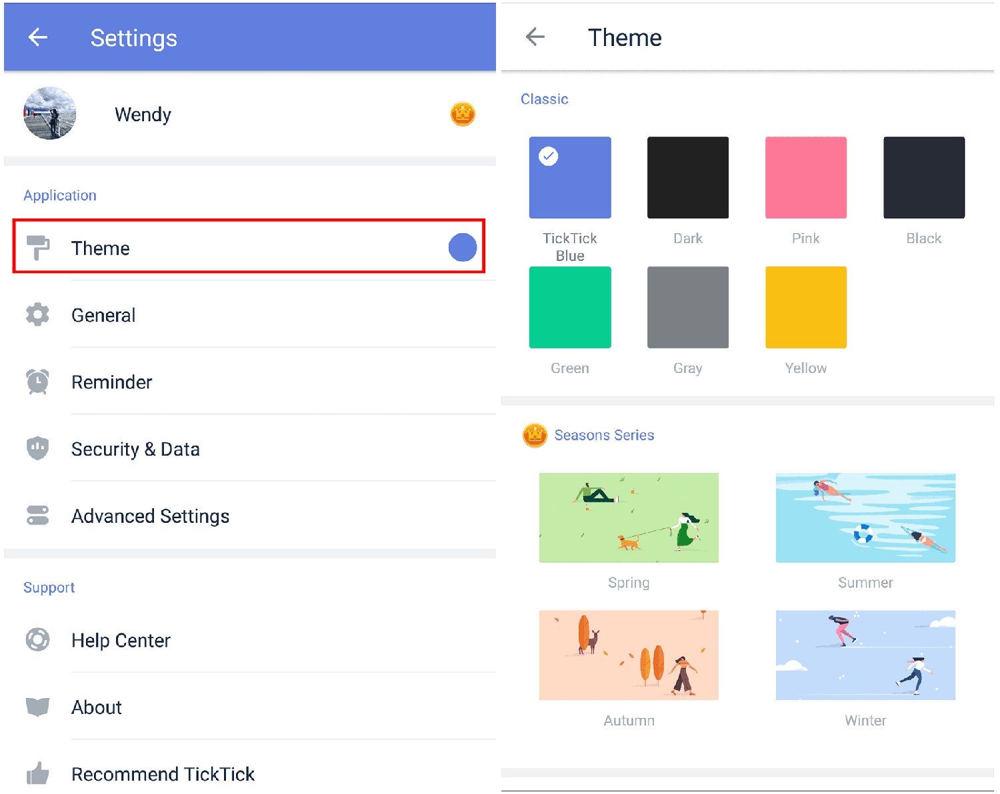

### How to change themes?

TickTick for Android gives you a choice of themes between various colors and other scenes.

1. Open TickTick on your Android device, then either swipe to the right or tap the hamburger button in the upper-left corner.

2. Tap the gear-shaped icon in the upper-right corner.

3. Tap "Theme" to select a theme.

